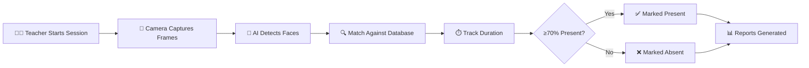

<p align="center">
  
</p>

<p align="center">
  
  
  
  
  
  
</p>

<p align="center">
  
  
  
  
  
</p>

<br/>

<p align="center">
  <b>Real-time face recognition attendance system</b> that continuously monitors and marks student presence during live classroom sessions — eliminating manual roll calls, proxy attendance, and human errors.
</p>

---

## 📋 Table of Contents

<details>
<summary>Click to expand</summary>

- [❓ Problem Statement](#-problem-statement)
- [💡 Solution Overview](#-solution-overview)
- [✨ Key Features](#-key-features)
- [🏗️ System Architecture](#️-system-architecture)
- [🛠️ Technology Stack](#️-technology-stack)
- [🤖 AI/ML Models Used](#-aiml-models-used)
- [📁 Project Structure](#-project-structure)
- [🔌 API Reference](#-api-reference)
- [🗄️ Database Design](#️-database-design)
- [🚀 Installation & Setup](#-installation--setup)
- [📖 Usage Guide](#-usage-guide)
- [🔒 Security & Privacy](#-security--privacy)
- [🔮 Future Scope](#-future-scope)
- [👥 Contributors](#-contributors)

</details>

---

## ❓ Problem Statement

Traditional attendance systems in educational institutions suffer from multiple critical issues:

| Problem | Impact |
|---------|--------|
| 📝 **Manual Roll Calls** | Wastes 5–10 minutes per class, consuming ~15% of teaching time daily |
| 🎭 **Proxy Attendance** | Students mark attendance for absent peers — undermining integrity |
| ❌ **Human Error** | Teachers mismark or forget entries — causing disputes at semester end |
| ⏱️ **No Duration Tracking** | A student arriving 40 min late is still marked "present" |
| 📄 **Paper-Based Records** | Difficult to search, analyze, or generate reports from paper sheets |
| 📊 **No Real-Time Insights** | Administrators lack live visibility into classroom occupancy |

> [!IMPORTANT]
> **The Core Challenge:** *How can we build a system that automatically identifies every student in a classroom, tracks how long they stay, and only marks them present if they attend a minimum percentage of the class — all without any manual intervention?*

---

## 💡 Solution Overview

**AttendAI** solves this by combining **real-time face recognition** with **duration-based presence tracking** in a web-based, multi-role platform:

```
┌───────────────────────────────────────────────────────────────────────┐
│                         AttendAI Pipeline                             │
│                                                                       │
│   📸 Camera Feed  →  🧠 AI Face Detection  →  🔍 Identity Matching   │
│        ↓                     ↓                        ↓               │
│   Live Video         Face Bounding Boxes         Student UID          │
│        ↓                     ↓                        ↓               │
│   🖥️ WebSocket      📊 Real-Time Overlay       ⏱️ Duration Track     │
│        ↓                     ↓                        ↓               │
│   Browser Display    Teacher Dashboard         ≥70% = ✅ Present      │
│                                                <70% = ❌ Absent       │
└───────────────────────────────────────────────────────────────────────┘
```

### How It Works (Step-by-Step)



1. **Teacher starts a session** → selects subject, section, and duration
2. **Camera captures video frames** → sent via WebSocket to server at ~10 FPS
3. **AI engine detects faces** → draws bounding boxes with student names
4. **Each recognized student** → timer starts tracking their visible duration
5. **Session ends** → students with ≥70% presence are marked **Present**
6. **Reports generated** → available for download as CSV, viewable in analytics

---

## ✨ Key Features

<table>
<tr>
<td width="50%" valign="top">

### 🎓 Student Portal
- **Personal Dashboard** — attendance %, subject-wise breakdown, calendar
- **Assignment Portal** — view, download, submit with AI-powered analysis
- **AI-Proctored Exams** — timed MCQ exams under AI surveillance
- **Profile Management** — update photo, password, personal details
- **Face Login** — authenticate via facial recognition

</td>
<td width="50%" valign="top">

### 👨‍🏫 Teacher Portal
- **Live Attendance Session** — AI auto-detects and tracks students
- **Smart Timetable** — recurring weekly schedule with auto-locking
- **Student Management** — add, remove, register student faces
- **Analytics & Reports** — filter, export CSV, visual charts
- **AI Copilot** — Groq LLM-powered teaching assistant chatbot

</td>
</tr>
<tr>
<td width="50%" valign="top">

### 🛡️ Admin Portal
- **System Dashboard** — real-time stats and quick actions
- **User Management** — CRUD for students & teachers with face registration
- **Section Management** — create and organize class sections
- **System Configuration** — face threshold, min presence %, frame skip
- **Backup & Restore** — full database backup and restore

</td>
<td width="50%" valign="top">

### 📝 AI Exam & Proctoring
- **AI Question Generation** — Groq LLaMA auto-generates MCQ papers
- **Multi-Signal Cheating Detection:**
  - 🔄 Head Turn Detection
  - 👁️ Eye Movement Tracking
  - 🗣️ Lip Movement Detection
  - 🏃 Body Movement Detection
  - 🚨 Tab Switch / Window Blur
  - 🔒 Copy/Paste/Right-Click Blocking
- **Detailed Violation Timeline** — every event logged with timestamp

</td>
</tr>
</table>

### 🌐 Platform-Wide Features

<p align="center">

| Feature | Description |
|---------|-------------|
| 🌙 **Dark Mode Glassmorphism UI** | Premium animated interface with Font Awesome icons |
| 📱 **Responsive Design** | Desktop, tablet, and mobile compatible |
| 🔐 **JWT Authentication** | Secure token-based sessions with 24hr expiry |
| ⚡ **Real-Time WebSocket** | Live video streaming and instant updates |
| 💬 **Floating AI Copilot** | Quick-access chatbot button on every page |
| 💡 **Inspirational Quotes** | Daily rotating motivational quotes on dashboard |

</p>

---

## 🏗️ System Architecture

```
┌─────────────────────────────────────────────────────────────────────────┐
│                           CLIENT (Browser)                              │
│                                                                         │
│  ┌───────────┐   ┌───────────┐   ┌───────────┐   ┌─────────────────┐   │
│  │  Student   │   │  Teacher   │   │   Admin    │   │  Landing Page   │   │
│  │  Portal    │   │  Portal    │   │  Portal    │   │  + Login        │   │
│  │  (5 pages) │   │  (9 pages) │   │  (5 pages) │   │  + Face Auth    │   │
│  └─────┬──────┘   └─────┬──────┘   └─────┬──────┘   └───────┬─────────┘   │
│        └────────────────┴────────────────┴───────────────────┘             │
│                                │                                           │
│                      HTTP REST + WebSocket                                 │
└──────────────────────────────┬─────────────────────────────────────────────┘
                               │
┌──────────────────────────────┼─────────────────────────────────────────────┐
│                     SERVER (Flask + Eventlet)                              │
│                              │                                             │
│  ┌───────────────────────────┴──────────────────────────────┐              │
│  │                  app.py (2550+ lines)                     │              │
│  │                                                           │              │
│  │  ┌──────────────┐  ┌───────────────┐  ┌──────────────┐   │              │
│  │  │  Auth Layer   │  │  Attendance   │  │  Assignment  │   │              │
│  │  │  JWT + Face   │  │  Engine       │  │  System      │   │              │
│  │  │  bcrypt       │  │  WebSocket    │  │  AI Grading  │   │              │
│  │  └──────────────┘  └───────────────┘  └──────────────┘   │              │
│  │                                                           │              │
│  │  ┌──────────────┐  ┌───────────────┐  ┌──────────────┐   │              │
│  │  │  Admin APIs   │  │  AI Chatbot   │  │  AI Exam &   │   │              │
│  │  │  CRUD, Backup │  │  Groq LLaMA   │  │  Proctoring  │   │              │
│  │  └──────────────┘  └───────────────┘  └──────────────┘   │              │
│  └───────────────────────────────────────────────────────────┘              │
│                              │                                             │
│  ┌───────────────────────────┴──────────────────────────────┐              │
│  │                 AI / ML Engine Layer                       │              │
│  │                                                           │              │
│  │  ┌──────────────────┐     ┌───────────────────────────┐   │              │
│  │  │  OpenCV DNN       │     │   Groq Cloud LLM          │   │              │
│  │  │  YuNet + SFace    │     │   LLaMA 3.3 70B           │   │              │
│  │  │  Face Detection   │     │   Chatbot + AI Grading    │   │              │
│  │  │  Face Embeddings  │     │   Exam Generation         │   │              │
│  │  └──────────────────┘     └───────────────────────────┘   │              │
│  └───────────────────────────────────────────────────────────┘              │
│                              │                                             │
│  ┌───────────────────────────┴──────────────────────────────┐              │
│  │                Database Layer (SQLite × 3)                │              │
│  │                                                           │              │
│  │  ┌──────────────┐  ┌───────────────┐  ┌──────────────┐   │              │
│  │  │ students.db  │  │  teachers.db  │  │   admin.db   │   │              │
│  │  │ Profiles     │  │  Profiles     │  │  Profiles    │   │              │
│  │  │ Attendance   │  │  Timetable    │  │  Sections    │   │              │
│  │  │ Assignments  │  │  Sessions     │  │  Settings    │   │              │
│  │  │ Engagement   │  │  Assignments  │  │  Audit Log   │   │              │
│  │  └──────────────┘  └───────────────┘  └──────────────┘   │              │
│  └───────────────────────────────────────────────────────────┘              │
└────────────────────────────────────────────────────────────────────────────┘
```

---

## 🛠️ Technology Stack

<table>
<tr>
<td valign="top" width="50%">

### ⚙️ Backend
| Technology | Purpose |
|-----------|---------|
| **Python 3.10+** | Core language |
| **Flask 3.0** | Web framework & REST API |
| **Flask-SocketIO** | Real-time WebSocket |
| **Eventlet** | Async WSGI server |
| **SQLite3** | Lightweight databases (×3) |
| **bcrypt** | Password hashing (12 rounds) |
| **PyJWT** | Token authentication |
| **Flask-CORS** | Cross-Origin support |

</td>
<td valign="top" width="50%">

### 🤖 AI / Machine Learning
| Technology | Purpose |
|-----------|---------|
| **OpenCV DNN** | Face detection & recognition |
| **YuNet** | SCRFD face detector |
| **SFace** | 128-dim face embeddings |
| **Groq API** | Cloud LLM inference |
| **LLaMA 3.3 70B** | Chatbot, grading, exams |
| **NumPy** | Numerical computing |
| **Pillow** | Image processing |

</td>
</tr>
<tr>
<td valign="top" width="50%">

### 🎨 Frontend
| Technology | Purpose |
|-----------|---------|
| **HTML5** | Semantic structure |
| **CSS3** | Glassmorphism design system |
| **Vanilla JavaScript** | Client-side logic |
| **Font Awesome 6.5** | Professional icons |
| **Socket.IO Client** | Real-time streaming |
| **Canvas API** | Face frame capture |

</td>
<td valign="top" width="50%">

### 📄 Document Processing
| Technology | Purpose |
|-----------|---------|
| **PyPDF2** | PDF text extraction |
| **python-docx** | Word document parsing |
| **Pillow** | Image & thumbnail generation |

</td>
</tr>
</table>

---

## 🤖 AI/ML Models Used

### 1️⃣ OpenCV DNN — YuNet + SFace (Face Recognition Engine)

```
Raw Frame (640×480)
        │
        ▼
┌───────────────────┐
│   YuNet Detector   │ ──→ Face bounding boxes + confidence scores
│   (SCRFD-based)    │
└────────┬──────────┘
         │
         ▼
┌───────────────────┐
│   5-Point Align    │ ──→ Normalized 112×112 face crop
└────────┬──────────┘
         │
         ▼
┌───────────────────┐
│   SFace Encoder    │ ──→ 128-dim embedding vector
└────────┬──────────┘
         │
         ▼
┌───────────────────┐
│ Cosine Similarity  │ ──→ Match against registered students
│  threshold: 0.40   │     (best match with highest similarity)
└────────┬──────────┘
         │
         ▼
┌───────────────────┐
│ Duration Tracker   │ ──→ Accumulate presence time per student
│   ≥70% = Present  │
└───────────────────┘
```

### 2️⃣ Groq LLaMA 3.3 70B (AI Intelligence Layer)

| Use Case | Description |
|----------|-------------|
| 💬 **AI Teaching Chatbot** | Context-aware assistant for teachers |
| 📝 **Assignment Grading** | Auto-analyze and grade submissions |
| 🧪 **MCQ Exam Generation** | Generate structured exam papers from topic + difficulty |
| 🔍 **Proctoring Analysis** | Post-exam integrity analysis from telemetry data |
| 📊 **Student Insights** | Behavioral analytics and engagement metrics |

---

## 📁 Project Structure

```
AttendAI/
│
├── 📄 README.md                    # This file
├── 📄 .gitignore                   # Git ignore rules
│
├── 🔧 backend/
│   ├── app.py                      # Main Flask server (2550+ lines, 60+ routes)
│   ├── config.py                   # Configuration & thresholds
│   ├── requirements.txt            # Python dependencies
│   ├── models/
│   │   ├── __init__.py             # Database schemas & initialization
│   │   └── face_models/            # ONNX model files (download required)
│   │       ├── face_detection_yunet_2023mar.onnx
│   │       └── face_recognition_sface_2021dec.onnx
│   ├── databases/                  # SQLite databases (auto-created)
│   │   ├── students.db
│   │   ├── teachers.db
│   │   └── admin.db
│   └── uploads/                    # User-uploaded files
│       ├── assignments/
│       ├── submissions/
│       └── profiles/
│
└── 🎨 frontend/
    ├── index.html                  # Landing page with role selection
    ├── login.html                  # Multi-role login (UID + Face ID)
    ├── css/
    │   ├── main.css                # Design system & variables
    │   ├── auth.css                # Authentication styles
    │   ├── dashboard.css           # Dashboard layout
    │   ├── components.css          # Reusable UI components
    │   └── exam.css                # Exam & proctoring styles
    ├── js/
    │   └── theme.js                # Dark/light mode toggle
    ├── student/                    # 🎓 Student Portal (5 pages)
    │   ├── dashboard.html
    │   ├── attendance.html
    │   ├── assignments.html
    │   ├── exams.html
    │   └── profile.html
    ├── teacher/                    # 👨‍🏫 Teacher Portal (9 pages)
    │   ├── dashboard.html
    │   ├── timetable.html
    │   ├── attendance.html
    │   ├── students.html
    │   ├── assignments.html
    │   ├── exams.html
    │   ├── reports.html
    │   ├── student-insights.html
    │   └── chatbot.html
    └── admin/                      # 🛡️ Admin Portal (5 pages)
        ├── dashboard.html
        ├── users.html
        ├── sections.html
        ├── reports.html
        └── settings.html
```

---

## 🔌 API Reference

<details>
<summary><b>🔐 Authentication (6 endpoints)</b></summary>

| Method | Endpoint | Description |
|--------|----------|-------------|
| `POST` | `/api/auth/login` | UID + password login |
| `POST` | `/api/auth/face-login` | Face recognition login |
| `POST` | `/api/auth/register` | Register new user |
| `POST` | `/api/auth/face-register` | Register face embedding |
| `GET`  | `/api/auth/verify` | Verify JWT token |
| `POST` | `/api/auth/change-password` | Change user password |

</details>

<details>
<summary><b>📋 Attendance (9 endpoints)</b></summary>

| Method | Endpoint | Description |
|--------|----------|-------------|
| `POST` | `/api/attendance/start` | Start live attendance session |
| `POST` | `/api/attendance/stop` | Stop active session |
| `GET`  | `/api/attendance/sessions` | Get all sessions |
| `GET`  | `/api/attendance/student/:uid` | Get student's attendance |
| `POST` | `/api/attendance/mark` | Mark attendance record |
| `POST` | `/api/attendance/override` | Manual override status |
| `GET`  | `/api/attendance/report` | Filtered attendance report |
| `GET`  | `/api/attendance/report/csv` | Export report as CSV |
| `POST` | `/api/attendance/manual` | Manual attendance entry |

</details>

<details>
<summary><b>📅 Timetable (3 endpoints)</b></summary>

| Method | Endpoint | Description |
|--------|----------|-------------|
| `GET`  | `/api/timetable` | Get teacher's schedule |
| `POST` | `/api/timetable` | Create new lecture slot |
| `DELETE`| `/api/timetable/:id` | Delete a lecture |

</details>

<details>
<summary><b>📝 Assignments (8 endpoints)</b></summary>

| Method | Endpoint | Description |
|--------|----------|-------------|
| `GET`  | `/api/assignments` | List assignments |
| `POST` | `/api/assignments` | Create assignment |
| `POST` | `/api/assignments/create-with-files` | Create with file uploads |
| `POST` | `/api/assignments/:id/submit` | Submit assignment |
| `POST` | `/api/assignments/:id/ai-analyze` | AI-powered analysis |
| `PUT`  | `/api/assignments/:id/grade` | Grade submission |
| `GET`  | `/api/assignments/:id/submissions` | View submissions |
| `GET`  | `/api/assignments/:id/my-submission` | Student's own submission |

</details>

<details>
<summary><b>🧪 AI Exams & Proctoring (9 endpoints)</b></summary>

| Method | Endpoint | Description |
|--------|----------|-------------|
| `POST` | `/api/exams` | Generate AI exam (Groq LLaMA) |
| `GET`  | `/api/exams` | List teacher's exams |
| `GET`  | `/api/exams/:id` | Get exam with questions |
| `POST` | `/api/exams/:id/publish` | Publish exam to students |
| `POST` | `/api/exams/:id/close` | Close exam submissions |
| `DELETE`| `/api/exams/:id/delete` | Delete exam permanently |
| `GET`  | `/api/exams/available` | Student: list available exams |
| `POST` | `/api/exams/:id/submit` | Submit answers + proctoring data |
| `GET`  | `/api/exams/:id/results` | Teacher: view results + proctoring |

</details>

<details>
<summary><b>⚙️ Admin (11 endpoints)</b></summary>

| Method | Endpoint | Description |
|--------|----------|-------------|
| `GET`  | `/api/admin/stats` | System statistics |
| `GET`  | `/api/admin/users` | List all users |
| `DELETE`| `/api/admin/users/:uid` | Delete user |
| `POST` | `/api/admin/users/:uid/toggle` | Enable/disable user |
| `GET`  | `/api/admin/sections` | List sections |
| `POST` | `/api/admin/sections` | Create section |
| `GET`  | `/api/admin/settings` | Get system settings |
| `POST` | `/api/admin/settings` | Update settings |
| `GET`  | `/api/admin/backup` | Download DB backup |
| `POST` | `/api/admin/restore` | Restore from backup |
| `POST` | `/api/admin/import-students` | Bulk CSV import |

</details>

<details>
<summary><b>⚡ WebSocket Events (Real-Time)</b></summary>

| Event | Direction | Description |
|-------|-----------|-------------|
| `start_stream` | Client → Server | Initialize live session |
| `video_frame` | Client → Server | Send camera frame (base64) |
| `frame_result` | Server → Client | Face detection results + overlay |
| `attendance_update` | Server → Client | Real-time presence updates |
| `stop_stream` | Client → Server | End session |

</details>

---

## 🗄️ Database Design

**Privacy-First Architecture** — 3 separate SQLite databases for role-based data isolation:

```
┌──────────────────┐   ┌──────────────────┐   ┌──────────────────┐
│   students.db    │   │   teachers.db    │   │    admin.db      │
│                  │   │                  │   │                  │
│  ● students      │   │  ● teachers      │   │  ● admins        │
│  ● attendance    │   │  ● timetable     │   │  ● sections      │
│  ● assignments   │   │  ● sessions      │   │  ● settings      │
│  ● submissions   │   │  ● assignments   │   │  ● audit_log     │
│  ● engagement    │   │  ● chat_messages │   │                  │
│  ● student_exams │   │  ● exams         │   │                  │
│                  │   │  ● exam_questions │   │                  │
│                  │   │  ● exam_results   │   │                  │
└──────────────────┘   └──────────────────┘   └──────────────────┘
```

<details>
<summary><b>View Key Table Schemas</b></summary>

**`students`** — Student profiles & face data
| Column | Type | Description |
|--------|------|-------------|
| uid | TEXT (PK) | Unique identifier (e.g., S001) |
| name | TEXT | Full name |
| email | TEXT | Email address |
| password_hash | TEXT | bcrypt hashed password (12 rounds) |
| section | TEXT | Class section (e.g., CSE-A) |
| face_embeddings | BLOB | 128-dim SFace vector (serialized) |
| face_registered | INTEGER | Whether face is registered |
| is_active | INTEGER | Account enabled/disabled |

**`attendance`** — Attendance records
| Column | Type | Description |
|--------|------|-------------|
| student_uid | TEXT | Foreign key to students |
| session_id | TEXT | UUID of the session |
| subject | TEXT | Subject name |
| date | TEXT | YYYY-MM-DD |
| status | TEXT | "present" or "absent" |
| present_duration_min | REAL | Minutes face was detected |
| presence_percentage | REAL | % of class attended |
| marked_by | TEXT | "ai" or "manual" |

</details>

---

## 🚀 Installation & Setup

### Prerequisites

| Requirement | Version | Link |
|------------|---------|------|
| **Python** | 3.10+ | [Download](https://www.python.org/downloads/) |
| **Webcam** | Any | Required for face recognition |
| **Browser** | Modern | Chrome, Edge, or Firefox |

### ⚡ Quick Start

```bash
# 1️⃣  Clone the repository
git clone https://github.com/n-shawarn/AttendAi.git
cd AttendAi

# 2️⃣  Install Python dependencies
pip install -r backend/requirements.txt

# 3️⃣  Download face models (place in backend/models/face_models/)
#     • face_detection_yunet_2023mar.onnx
#     • face_recognition_sface_2021dec.onnx
#     (See links below)

# 4️⃣  Start the server
python backend/app.py

# 5️⃣  Open in browser
#     http://localhost:5000
```

> [!NOTE]
> **Face Model Downloads:**
> - [YuNet Face Detector](https://github.com/opencv/opencv_zoo/tree/main/models/face_detection_yunet) — `face_detection_yunet_2023mar.onnx`
> - [SFace Recognizer](https://github.com/opencv/opencv_zoo/tree/main/models/face_recognition_sface) — `face_recognition_sface_2021dec.onnx`
>
> Place both files in `backend/models/face_models/`

### 🔑 Default Credentials

| Role | UID | Password | Portal |
|------|-----|----------|--------|
| 🛡️ Admin | `ADMIN001` | `admin123` | System management |
| 👨‍🏫 Teacher | `T002` | `vivek@2005` | Attendance & teaching |
| 🎓 Student | `S001` | *(set during registration)* | Student dashboard |

---

## 📖 Usage Guide

<details>
<summary><b>1️⃣ Register Students (Admin)</b></summary>

1. Login as **Admin** → Go to **User Management**
2. Click **+ Add User** → Select role "Student"
3. Fill UID, name, email, section, password
4. Click **Register Face** to capture face embedding

</details>

<details>
<summary><b>2️⃣ Create Timetable (Teacher)</b></summary>

1. Login as **Teacher** → Go to **Schedule**
2. Click **+ New Lecture**
3. Set subject, day, time, section, room
4. Schedule automatically recurs weekly

</details>

<details>
<summary><b>3️⃣ Take Live Attendance (Teacher)</b></summary>

1. Go to **Live Session** or click **Start Session** on Dashboard
2. Select subject and section → Click **Start**
3. AI camera activates → students' faces are detected and tracked
4. Real-time overlay shows recognized students with bounding boxes
5. Click **Stop** when class ends → attendance is finalized

</details>

<details>
<summary><b>4️⃣ View Reports (Teacher/Admin)</b></summary>

1. Go to **Analytics** → Apply filters (section, subject, date range)
2. View summary cards, charts, and detailed records
3. Click **Export CSV** to download spreadsheet

</details>

---

## 🔒 Security & Privacy

| Feature | Implementation |
|---------|---------------|
| 🔑 **Password Hashing** | bcrypt with 12 salt rounds |
| 🎫 **Token Auth** | JWT with 24-hour expiry, HMAC-SHA256 |
| 🗃️ **Data Isolation** | 3 separate SQLite databases |
| 👤 **Face Data** | Stored as numerical vectors, not images |
| 🌐 **CORS Protection** | Flask-CORS with configurable origins |
| ✅ **Input Validation** | Server-side validation on all endpoints |
| 📝 **Audit Trail** | All overrides logged with timestamp & actor |

---

## 📊 Performance Metrics

| Metric | Value |
|--------|-------|
| ⚡ Face Detection Speed | ~30ms/frame (GPU) · ~100ms (CPU) |
| 🎯 Recognition Accuracy | 99.83% (LFW benchmark) |
| 🔄 WebSocket Latency | <50ms round-trip |
| 🏫 Concurrent Sessions | Up to 10 classrooms |
| 💾 Database Size | ~2MB per 1000 students |
| 🎬 Frame Processing | ~10 FPS (every 3rd frame) |
| ⏱️ Minimum Presence | 70% of class duration |

---

## 🔮 Future Scope

- [x] AI-Proctored Examinations with MCQ generation
- [x] Multi-Signal Cheating Detection (head, eyes, lips, body, tabs)
- [ ] Anti-Spoofing / Liveness Detection
- [ ] Multi-Camera Support across classrooms
- [ ] Mobile App (React Native)
- [ ] Cloud Deployment (AWS/GCP + PostgreSQL)
- [ ] Parent Portal with real-time notifications
- [ ] Advanced Proctoring (audio, multi-person, phone detection)
- [ ] QR Code Backup for attendance
- [ ] Multi-Language Support (Hindi, regional languages)

---

## 👥 Contributors

<table>
<tr>
<td align="center">
<b>Vivek Ash</b><br/>
<sub>Full Stack Developer & AI Engineer</sub>
</td>
</tr>
</table>

---

## 📄 License

This project is licensed under the **MIT License** — see the [LICENSE](LICENSE) file for details.

---

<p align="center">
  
</p>

<p align="center">
  <sub>AttendAI © 2026 — AI Smart Attendance System</sub>
</p>
